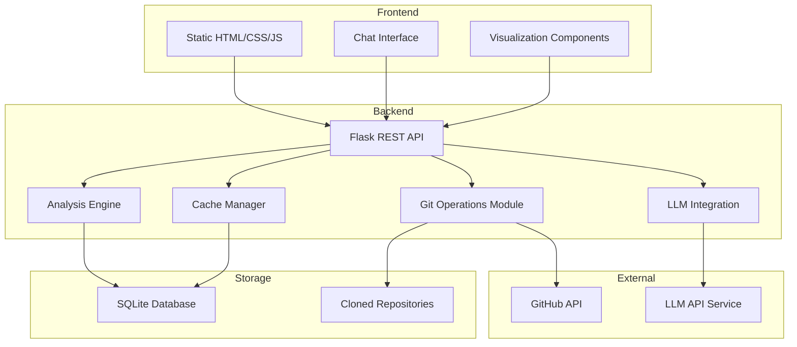

# Codebase Time Machine - Architecture Plan

## Project Overview
A web-based tool to navigate any codebase through time, understanding the evolution of features and architectural decisions. The system analyzes git repositories to provide insights about code changes, patterns, and ownership over time.

## Technology Stack
- **Backend**: Python with Flask
- **Database**: SQLite (local storage for caching)
- **Frontend**: Static HTML/CSS with Vanilla JavaScript
- **Git Operations**: GitPython library + GitHub API
- **LLM Integration**: OpenAI API or Claude API for natural language processing
- **Visualization**: Chart.js for graphs and D3.js for complex visualizations

## System Architecture



## Component Details

### 1. Frontend Components

#### Repository Input
- URL validation for GitHub public repositories
- Loading states and progress indicators
- Error handling and user feedback

#### Chat Interface
- Natural language query input
- Command support (/timeline, /authors, etc.)
- Response rendering with markdown support
- Query history

#### Visualization Dashboard
- Timeline charts (commit activity over time)
- Code ownership heatmaps
- Dependency graphs
- Complexity trend charts
- Interactive filters and zoom capabilities

### 2. Backend Modules

#### Flask REST API Endpoints
```
POST   /api/repository/analyze    - Initialize repository analysis
GET    /api/repository/{id}/status - Check analysis progress
POST   /api/chat/query           - Process natural language queries
GET    /api/commits/timeline     - Get commit timeline data
GET    /api/ownership/{file}     - Get code ownership data
GET    /api/complexity/trends    - Get complexity metrics over time
GET    /api/patterns/search      - Search for code patterns
```

#### Git Operations Module
- **Hybrid Approach**:
  - Use GitHub API for metadata (commits, authors, dates)
  - Clone repository for deep code analysis
  - Progressive loading for large repositories
- **Features**:
  - Repository cloning and management
  - Branch tracking
  - Diff analysis
  - File history traversal

#### Analysis Engine
- **Commit History Analysis**:
  - Parse commit messages
  - Track file changes
  - Identify merge patterns
- **Code Ownership**:
  - Calculate contribution percentages
  - Track author evolution
  - Identify primary maintainers
- **Pattern Detection**:
  - Identify architectural patterns
  - Track pattern introduction/removal
  - Detect refactoring events
- **Complexity Metrics**:
  - Cyclomatic complexity
  - Lines of code trends
  - Dependency analysis

#### LLM Integration
- Process natural language queries
- Generate insights from code evolution
- Answer "why" questions about changes
- Summarize architectural decisions

### 3. Database Schema

```sql
-- Repositories table
CREATE TABLE repositories (
    id INTEGER PRIMARY KEY,
    url TEXT UNIQUE NOT NULL,
    name TEXT NOT NULL,
    last_analyzed TIMESTAMP,
    total_commits INTEGER,
    status TEXT
);

-- Commits table
CREATE TABLE commits (
    id TEXT PRIMARY KEY,
    repo_id INTEGER,
    author TEXT,
    email TEXT,
    timestamp TIMESTAMP,
    message TEXT,
    files_changed INTEGER,
    insertions INTEGER,
    deletions INTEGER,
    FOREIGN KEY (repo_id) REFERENCES repositories(id)
);

-- Files table
CREATE TABLE files (
    id INTEGER PRIMARY KEY,
    repo_id INTEGER,
    path TEXT,
    current_complexity REAL,
    total_commits INTEGER,
    created_at TIMESTAMP,
    last_modified TIMESTAMP,
    FOREIGN KEY (repo_id) REFERENCES repositories(id)
);

-- Code ownership table
CREATE TABLE ownership (
    id INTEGER PRIMARY KEY,
    file_id INTEGER,
    author TEXT,
    lines_contributed INTEGER,
    percentage REAL,
    FOREIGN KEY (file_id) REFERENCES files(id)
);

-- Patterns table
CREATE TABLE patterns (
    id INTEGER PRIMARY KEY,
    repo_id INTEGER,
    pattern_type TEXT,
    first_seen_commit TEXT,
    last_seen_commit TEXT,
    description TEXT,
    FOREIGN KEY (repo_id) REFERENCES repositories(id)
);

-- Query cache table
CREATE TABLE query_cache (
    id INTEGER PRIMARY KEY,
    query_hash TEXT UNIQUE,
    query_text TEXT,
    response TEXT,
    created_at TIMESTAMP,
    expires_at TIMESTAMP
);
```

## Data Flow

### Repository Analysis Flow
1. User submits GitHub repository URL
2. System validates URL and checks cache
3. If not cached or outdated:
   - Fetch metadata via GitHub API
   - Clone repository locally
   - Run analysis pipeline
   - Store results in SQLite
4. Return analysis status to frontend

### Query Processing Flow
1. User submits natural language query
2. Check query cache for recent results
3. If not cached:
   - Parse query intent
   - Route to appropriate analyzer
   - Process with LLM if needed
   - Generate response
   - Cache result
4. Return formatted response with visualizations

## Implementation Phases

### Phase 1: Core Infrastructure (Week 1)
- Set up Flask backend
- Implement GitHub API integration
- Create basic database schema
- Build repository cloning system

### Phase 2: Basic Analysis (Week 2)
- Implement commit history analysis
- Build code ownership tracking
- Create simple REST endpoints
- Develop basic frontend structure

### Phase 3: Advanced Features (Week 3)
- Add pattern detection
- Implement complexity metrics
- Integrate LLM for natural language
- Build chat interface

### Phase 4: Visualizations (Week 4)
- Create timeline charts
- Build ownership heatmaps
- Implement interactive dashboards
- Add progressive loading

## Performance Considerations

### Caching Strategy
- Cache analyzed repository data for 24 hours
- Cache LLM responses for 1 hour
- Implement incremental updates for existing repos
- Use pagination for large result sets

### Scalability
- Limit concurrent repository analyses
- Implement queue system for analysis requests
- Use worker threads for CPU-intensive operations
- Set maximum repository size limits (10k commits)

## Security Considerations
- Only support public repositories
- Sanitize all user inputs
- Implement rate limiting
- Store API keys securely (environment variables)
- No execution of repository code

## Deployment
- Single machine deployment
- Docker containerization optional
- Requirements:
  - Python 3.9+
  - 10GB storage for repositories
  - 2GB RAM minimum
  - Git installed

## Error Handling
- Graceful degradation for missing features
- Clear error messages for users
- Logging for debugging
- Retry logic for API failures
- Fallback to cached data when possible